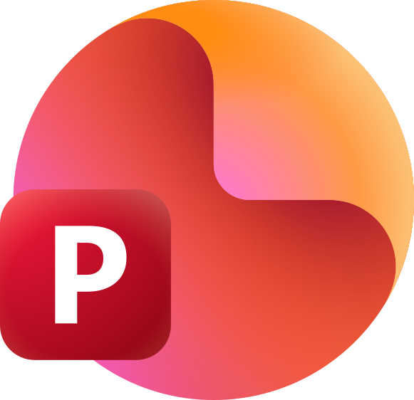

<p align="center">
  <a href="https://app.airweave.ai" target="_blank" rel="noopener noreferrer">
    <picture>
      <source media="(prefers-color-scheme: dark)" srcset="frontend/public/logo-airweave-darkbg.svg"/>
      <source media="(prefers-color-scheme: light)" srcset="frontend/public/logo-airweave-lightbg.svg"/>
      
    </picture>
  </a>
</p>

<p align="center">Open-source context retrieval layer for AI agents and RAG systems.</p>

<p align="center">
  <a href="https://app.airweave.ai" target="_blank"></a>
  <a href="https://docs.airweave.ai" target="_blank"></a>
  <a href="https://x.com/airweave_ai" target="_blank"></a>
  <a href="https://cursor.com/link/prompt?text=Help%20me%20set%20up%20Airweave%20locally.%20Follow%20these%20steps%3A%0A%0A1.%20First%2C%20verify%20Docker%20is%20installed%20and%20running%3A%0A%20%20%20docker%20--version%0A%20%20%20docker%20info%0A%0A2.%20Clone%20the%20repository%3A%0A%20%20%20git%20clone%20https%3A%2F%2Fgithub.com%2Fairweave-ai%2Fairweave.git%0A%20%20%20cd%20airweave%0A%0A3.%20Start%20Airweave%3A%0A%20%20%20.%2Fstart.sh%0A%0A4.%20The%20script%20will%20automatically%3A%0A%20%20%20-%20Create%20.env%20from%20.env.example%0A%20%20%20-%20Generate%20required%20secrets%20%28ENCRYPTION_KEY%2C%20STATE_SECRET%29%0A%20%20%20-%20Start%20all%20services%20with%20health%20checks%0A%20%20%20-%20Optionally%20prompt%20for%20OpenAI%2FMistral%20API%20keys%0A%0A5.%20Wait%20for%20all%20services%20to%20be%20healthy%20%28this%20may%20take%202-3%20minutes%20on%20first%20run%29%0A%0A6.%20Verify%20the%20app%20is%20accessible%20at%20http%3A%2F%2Flocalhost%3A8080%0A%0AIf%20there%20are%20any%20errors%2C%20help%20me%20troubleshoot%20them.%20Common%20issues%3A%0A-%20Port%20already%20in%20use%20%288080%2C%208001%2C%205432%2C%206333%2C%206379%2C%207233%2C%208081%2C%208088%29%0A-%20Docker%20not%20running%0A-%20Check%20logs%3A%20docker%20logs%20airweave-backend%20or%20docker%20logs%20airweave-frontend%0A%0AUseful%20commands%3A%0A-%20.%2Fstart.sh%20--restart%20%28restart%20services%29%0A-%20.%2Fstart.sh%20--skip-frontend%20%28backend%20only%29%0A-%20.%2Fstart.sh%20--destroy%20%28clean%20up%20everything%29"></a>
</p>

<p align="center">
  <a href="https://github.com/airweave-ai/airweave/actions/workflows/code-quality.yml"></a>
  <a href="https://github.com/airweave-ai/airweave/actions/workflows/eslint.yml"></a>
  <a href="https://github.com/airweave-ai/airweave/actions/workflows/test-public-api.yml"></a>
  <a href="https://pepy.tech/projects/airweave-sdk"></a>
  <a href="https://discord.gg/gDuebsWGkn"></a>
</p>

<p align="center">
  <video width="100%" src="https://github.com/user-attachments/assets/995e4a36-3f88-4d8e-b401-6ca43db0c7bf" controls></video>
</p>

### What is Airweave?
Airweave connects to your apps, tools, and databases, continuously syncs their data, and exposes it through a unified, LLM-friendly search interface. AI agents query Airweave to retrieve relevant, grounded, up-to-date context from multiple sources in a single request.

### Where it fits
Airweave sits between your data sources and AI systems as shared retrieval infrastructure. It handles authentication, ingestion, syncing, indexing, and retrieval so you don't have to rebuild fragile pipelines for every agent or integration.

### How it works
1. **Connect** your apps, databases, and documents (50+ integrations)
2. **Airweave** syncs, indexes, and exposes your data through a unified retrieval layer
3. **Agents query** Airweave via our SDKs, REST API, MCP, or native integrations with popular agent frameworks
4. **Agents retrieve** relevant, grounded context on demand

## Quickstart

### Cloud-hosted: [app.airweave.ai](https://app.airweave.ai)

<a href="https://app.airweave.ai"></a>

### Self-hosted

```bash
git clone https://github.com/airweave-ai/airweave.git
cd airweave
./start.sh
```

→ http://localhost:8080

> Requires Docker and docker-compose

## Supported Integrations

<!-- START_APP_GRID -->

<p align="center">





</p>

<!-- END_APP_GRID -->

<p align="center"><a href="https://docs.airweave.ai/connectors/overview"></a></p>

## SDKs

```bash
pip install airweave-sdk        # Python
npm install @airweave/sdk       # TypeScript
```

```python
from airweave import AirweaveSDK

client = AirweaveSDK(api_key="YOUR_API_KEY")
results = client.collections.search.instant(
    readable_id="my-collection",
    query="Find recent failed payments"
)
```

<a href="https://docs.airweave.ai"></a>
<a href="https://github.com/airweave-ai/airweave/tree/main/examples"></a>

## CLI

Search collections, manage sources, and trigger syncs from your terminal:

```bash
pip install airweave-cli
```

```bash
airweave auth login
airweave search "quarterly revenue figures" --collection finance-data
```

The CLI outputs rich interactive results in your terminal and clean JSON when piped — making it work for both developers and AI agents.

<a href="https://docs.airweave.ai/cli"></a>

## Tech Stack

- **Frontend**: [React/TypeScript](https://react.dev/) with [ShadCN](https://ui.shadcn.com/)
- **Backend**: [FastAPI](https://fastapi.tiangolo.com/) (Python)
- **Databases**: [PostgreSQL](https://www.postgresql.org/) (metadata), [Vespa](https://vespa.ai/) (vectors)
- **Workers**: [Temporal](https://temporal.io/) (orchestration), [Redis](https://redis.io/) (pub/sub)
- **Deployment**: [Docker Compose](https://docs.docker.com/compose/) (dev), [Kubernetes](https://kubernetes.io/) (prod)

## Contributing

We welcome contributions! See our [Contributing Guide](CONTRIBUTING.md).

## License

[MIT License](LICENSE)

<p align="center">
  <a href="https://discord.gg/gDuebsWGkn">Discord</a> ·
  <a href="https://github.com/airweave-ai/airweave/issues">Issues</a> ·
  <a href="https://x.com/airweave_ai">Twitter</a>
</p>

## ❓ FAQ

### General

**Q: What is Airweave?**

A: Airweave is an **open-source context retrieval layer for AI agents and RAG systems**. It connects to your apps, tools, and databases, continuously syncs their data, and exposes it through a unified, LLM-friendly search interface. AI agents query Airweave to retrieve relevant, grounded, up-to-date context from multiple sources in a single request.

**Q: How is Airweave different from traditional RAG systems?**

A: Traditional RAG requires you to build ingestion pipelines for each data source. Airweave provides:
- **50+ pre-built integrations** — Connect apps instantly (GitHub, Notion, Gmail, Slack, etc.)
- **Unified retrieval layer** — One API to search across all connected sources
- **Continuous syncing** — Data stays fresh automatically
- **Agent-ready SDKs** — Python + TypeScript SDKs designed for AI agents
- **MCP support** — Native Model Context Protocol integration

Think of Airweave as shared retrieval infrastructure — you build it once, and all your agents use it.

**Q: Where does Airweave fit in my architecture?**

A: Airweave sits between your data sources and AI systems:
1. **Connect** your apps, databases, and documents (50+ integrations)
2. **Airweave** syncs, indexes, and exposes your data through unified retrieval
3. **Agents query** Airweave via SDKs, REST API, MCP, or native framework integrations
4. **Agents retrieve** relevant, grounded context on demand

### Getting Started

**Q: How do I get started?**

A: Two options:

**Cloud-hosted (fastest)**:
- Visit [app.airweave.ai](https://app.airweave.ai)
- Sign up and connect your first integration
- Start querying immediately

**Self-hosted**:
```bash
git clone https://github.com/airweave-ai/airweave.git
cd airweave
./start.sh
```
→ http://localhost:8080

Requires Docker and docker-compose.

**Q: What are the differences between Cloud and Self-Hosted?**

A:
- **Cloud**: Managed service, no infrastructure, instant setup
- **Self-Hosted**: Full control over data, on-premise deployment, suitable for privacy-sensitive scenarios

### Integrations

**Q: What integrations does Airweave support?**

A: Airweave supports **50+ integrations** including:
- **Productivity**: Notion, Confluence, Slack, Asana, Trello, Jira
- **Storage**: Google Drive, Dropbox, Box, OneDrive, SharePoint
- **Communication**: Gmail, Intercom, Zoom, Microsoft Teams
- **Development**: GitHub, GitLab, Bitbucket, Linear
- **CRM**: HubSpot, Salesforce, Attio, Apollo.io
- **Finance**: Stripe
- **Documents**: Google Docs, PowerPoint, Coda, Slab, Slite
- **Support**: Zendesk, Freshdesk, ServiceNow
- **Calendar**: Google Calendar, cal.com
- **Other**: Airtable, ClickUp, FireFlies (meeting transcription)

See [Connectors Overview](https://docs.airweave.ai/connectors/overview) for full list.

**Q: How do I add a new integration?**

A:
1. Go to Airweave dashboard (Cloud or Self-hosted)
2. Navigate to "Connections" or "Sources"
3. Select the integration type
4. Authenticate with OAuth or API key
5. Configure sync settings
6. Start syncing

Airweave handles authentication, ingestion, indexing, and ongoing synchronization.

### SDKs & CLI

**Q: What SDKs are available?**

A:
- **Python SDK**: `pip install airweave-sdk`
  ```python
  from airweave import AirweaveSDK
  client = AirweaveSDK(api_key="YOUR_API_KEY")
  results = client.collections.search.instant(
      readable_id="my-collection",
      query="Find recent failed payments"
  )
  ```

- **TypeScript SDK**: `npm install @airweave/sdk`

See [SDK Documentation](https://docs.airweave.ai) for details.

**Q: Does Airweave have a CLI?**

A: Yes! Install via `pip install airweave-cli`:
```bash
airweave auth login
airweave search "quarterly revenue figures" --collection finance-data
```

CLI outputs rich interactive results in terminal and clean JSON when piped — works for both developers and AI agents.

**Q: Does Airweave support MCP?**

A: Yes, Airweave provides native MCP (Model Context Protocol) integration. Agents can query Airweave through MCP for standardized retrieval.

### Technical Details

**Q: What is Airweave's tech stack?**

A:
- **Frontend**: React/TypeScript with ShadCN UI
- **Backend**: FastAPI (Python)
- **Metadata DB**: PostgreSQL
- **Vector Search**: Vespa (high-performance vector engine)
- **Orchestration**: Temporal (workflow management)
- **Pub/Sub**: Redis
- **Deployment**: Docker Compose (dev), Kubernetes (prod)

**Q: How does Airweave handle syncing?**

A: Airweave uses Temporal for orchestration:
- **Scheduled syncs**: Periodic full syncs or incremental updates
- **Event-driven syncs**: Real-time updates when data changes
- **Retry handling**: Automatic retries for failed sync operations
- **Monitoring**: Track sync status via dashboard or API

**Q: How does retrieval work?**

A: Airweave combines:
- **Vector search**: Semantic similarity via Vespa
- **Metadata filtering**: Filter by source, date, type
- **Unified ranking**: Aggregate results from multiple sources
- **Grounded context**: Return source attribution for verification

### Performance & Scale

**Q: How many sources can I connect?**

A: There's no hard limit. Airweave handles multiple sources through unified retrieval — query across 50+ connected sources in one request.

**Q: How does Airweave handle large datasets?**

A:
- Vespa provides scalable vector search for millions of documents
- Temporal manages distributed sync operations
- PostgreSQL handles metadata efficiently
- Redis pub/sub enables real-time updates

### Troubleshooting

**Q: Sync failed for an integration. What should I do?**

A:
1. Check authentication status (OAuth token may have expired)
2. Verify API key is valid
3. Review sync logs in dashboard
4. Check rate limits for the external API
5. Restart sync manually or wait for next scheduled sync

Airweave provides automatic retries for transient failures.

**Q: Search results not relevant?**

A:
1. Ensure sources are fully synced
2. Try more specific queries
3. Use metadata filtering to narrow results
4. Check that documents are properly indexed
5. Verify collection configuration

**Q: Docker start.sh failed?**

A:
1. Ensure Docker is installed and running: `docker --version && docker info`
2. Check that ports (8080, 8001, 5432, 6333, 6379, 7233, 8081, 8088) are not in use
3. Review logs: `docker logs airweave-backend` or `docker logs airweave-frontend`
4. Try restart: `./start.sh --restart`
5. Clean up and restart: `./start.sh --destroy` then `./start.sh`

### Help & Resources

- **Documentation**: [docs.airweave.ai](https://docs.airweave.ai)
- **Example Notebooks**: [github.com/airweave-ai/airweave/tree/main/examples](https://github.com/airweave-ai/airweave/tree/main/examples)
- **Discord**: [discord.gg/gDuebsWGkn](https://discord.gg/gDuebsWGkn)
- **GitHub Issues**: [github.com/airweave-ai/airweave/issues](https://github.com/airweave-ai/airweave/issues)
- **Twitter**: [@airweave_ai](https://x.com/airweave_ai)
