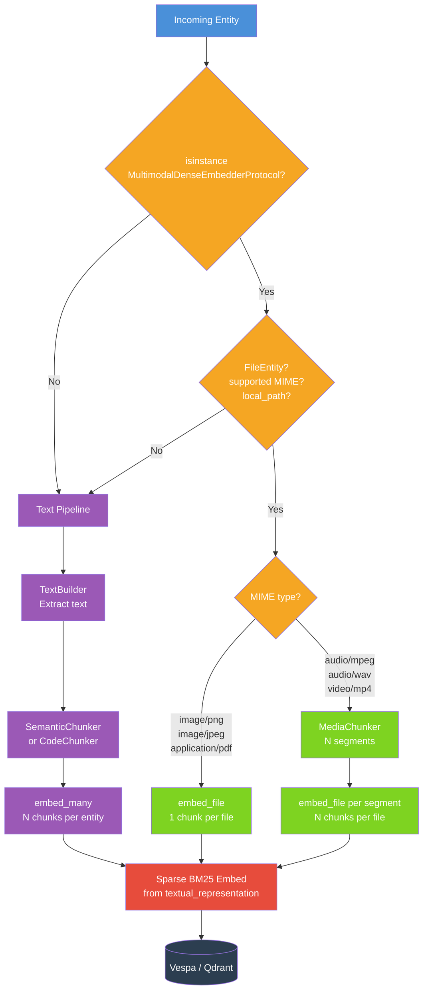
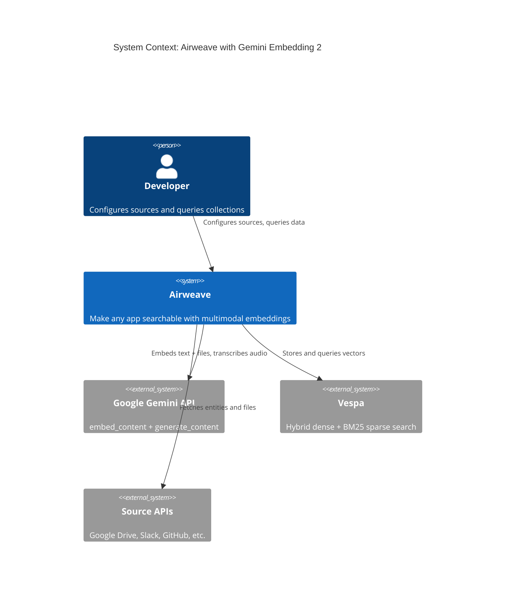
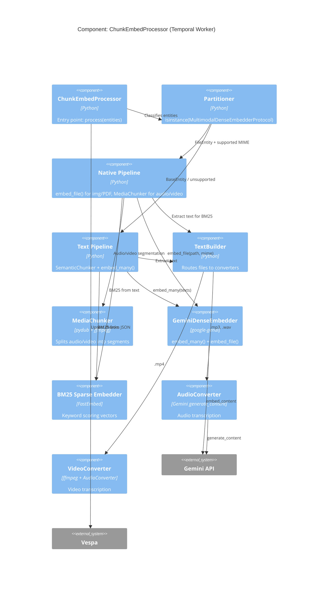
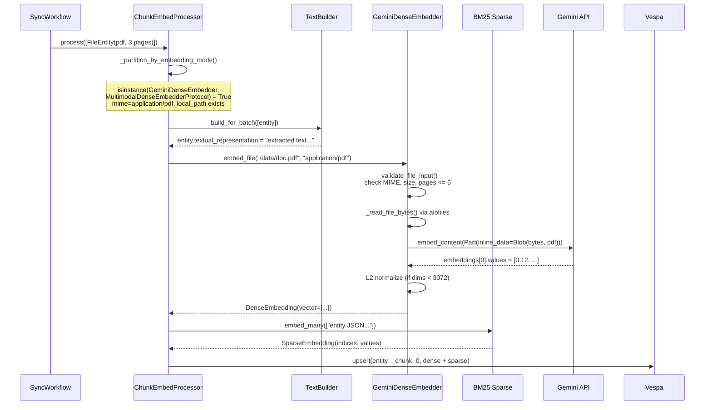
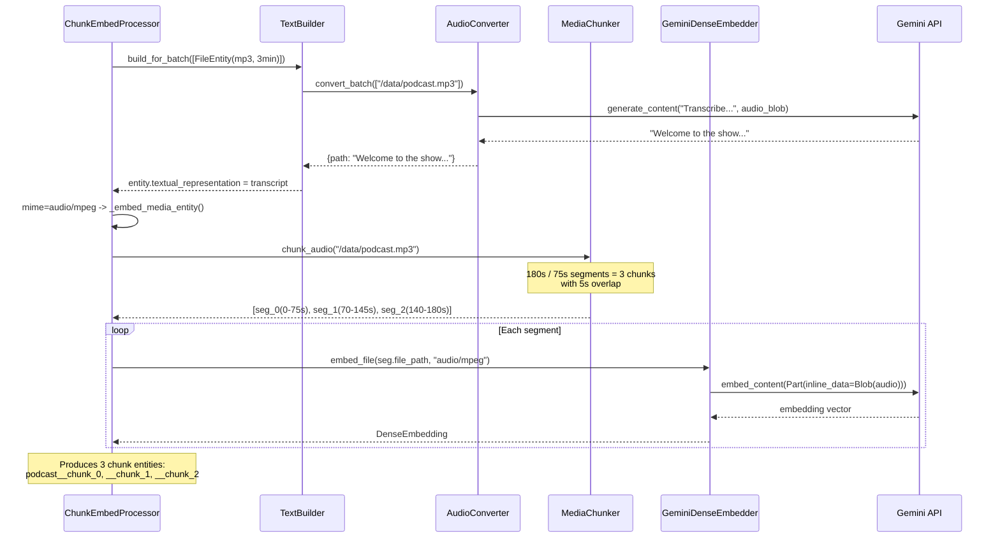
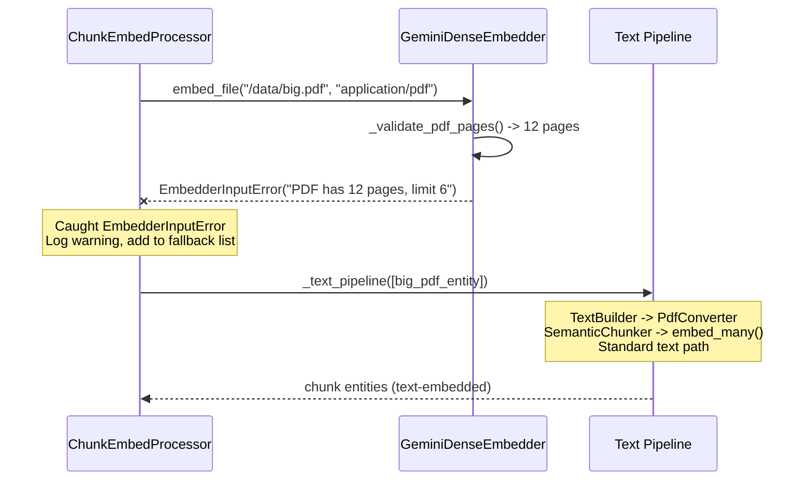
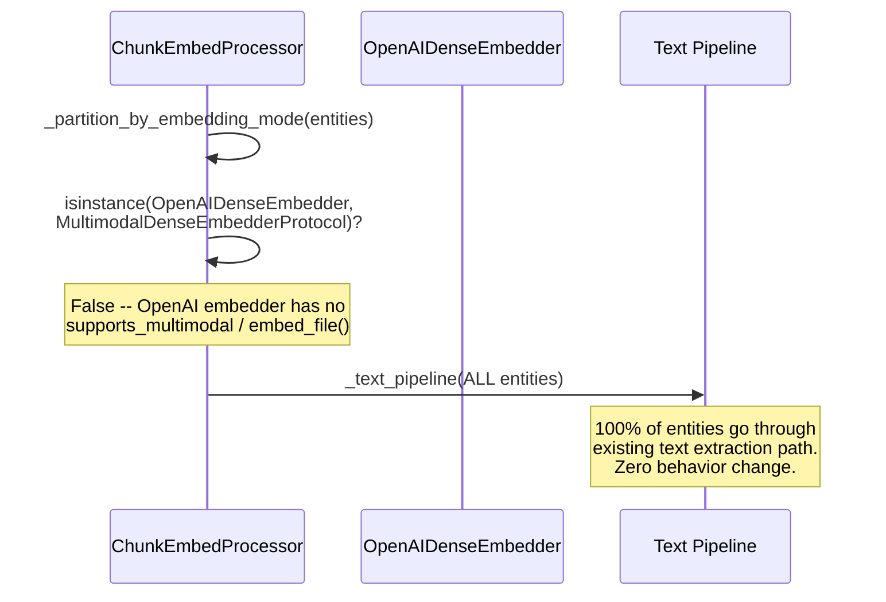

# Gemini Embedding 2: Full Multimodal Embedding Pipeline

> Native PDF, image, audio, and video embedding through Airweave's Vespa + Temporal pipeline, powered by Google's Gemini Embedding 2 model.

## What This Adds

Airweave's embedding pipeline previously extracted text from every file before computing vectors.
This feature extends that pipeline so the Gemini Embedding 2 provider can **embed raw files directly** -- PDFs, images, audio, and video -- through the native multimodal API, producing a single unified vector space where text queries retrieve documents, screenshots, recordings, and clips.

### Pipeline Decision Flow



### System Context



### Component Detail: Embedding Pipeline



## Interaction Diagrams

### Image/PDF Native Embedding (Happy Path)



### Audio Chunking + Embedding



### Fallback: PDF Too Large



### Protocol Detection (Non-Multimodal Embedder)



## Architecture at a Glance

| Layer | Component | What it does |
|-------|-----------|-------------|
| **Protocol** | `MultimodalDenseEmbedderProtocol` | Runtime-checkable interface for `embed_file()` |
| **Embedder** | `GeminiDenseEmbedder.embed_file()` | Validates, reads, sends `Part(inline_data=Blob(...))` to Gemini |
| **Pipeline** | `ChunkEmbedProcessor._partition_by_embedding_mode()` | Routes FileEntity to native or text path |
| **Pipeline** | `ChunkEmbedProcessor._native_multimodal_pipeline()` | 1-chunk-per-file for images/PDFs, N-chunks for media |
| **Chunker** | `MediaChunker` | Splits audio (pydub) and video (ffmpeg) into embeddable segments |
| **Converter** | `AudioConverter` / `VideoConverter` | Gemini-based transcription for BM25 sparse scoring |
| **Config** | `ENABLE_MEDIA_SYNC` | Feature flag gating audio/video support |

## Key Design Decisions

1. **Protocol, not class hierarchy** -- `MultimodalDenseEmbedderProtocol` is `@runtime_checkable`. The pipeline detects capability via `isinstance()`, so OpenAI/Mistral/Local embedders are unaffected. ([ADR-001](./adr-001-protocol-over-inheritance.md))

2. **File path, not bytes** -- `embed_file()` takes a path string, reads from disk inside the embedder, and discards bytes after the API call. This prevents the `model_copy(deep=True)` memory amplification at chunk_embed.py:203. ([ADR-002](./adr-002-file-path-over-bytes.md))

3. **Text always extracted** -- Even for natively-embedded files, `textual_representation` is populated via existing converters. BM25 sparse scoring, answer generation, and reranking all depend on text.

4. **Graceful fallback** -- If `embed_file()` raises `EmbedderInputError` (too many pages, oversized), the entity silently falls back to the text pipeline with a warning log.

5. **Audio/video behind feature flag** -- `ENABLE_MEDIA_SYNC=false` by default. When disabled, Google Drive skips video files (existing behavior). When enabled, `MediaChunker` splits into segments within Gemini's duration limits. ([ADR-003](./adr-003-feature-flag-for-media.md))

## File Inventory

### New Files (7)
| File | Lines | Purpose |
|------|-------|---------|
| `domains/embedders/dense/tests/test_gemini_multimodal.py` | ~360 | 24 tests: file validation, embed_file, API errors, protocol compliance |
| `platform/chunkers/media.py` | ~200 | MediaChunker + MediaSegment for audio/video splitting |
| `platform/converters/audio_converter.py` | ~95 | Gemini-based audio transcription |
| `platform/converters/video_converter.py` | ~110 | Audio extraction + transcription for video |
| `tests/unit/platform/chunkers/test_media.py` | ~200 | 8 tests for audio/video chunking |
| `tests/unit/platform/converters/test_audio_converter.py` | ~80 | 5 tests for audio transcription |
| `tests/unit/platform/sync/processors/test_chunk_embed_multimodal.py` | ~200 | 10 tests for pipeline routing and fallback |

### Modified Files (11)
| File | Change |
|------|--------|
| `domains/embedders/protocols.py` | +`MultimodalDenseEmbedderProtocol` |
| `domains/embedders/dense/gemini.py` | +`embed_file()`, multimodal validation, error refactor |
| `domains/embedders/fakes/embedder.py` | +`FakeMultimodalDenseEmbedder` |
| `platform/sync/processors/chunk_embed.py` | Refactored into text + native pipelines |
| `platform/converters/__init__.py` | Registered audio/video converters |
| `platform/sync/pipeline/text_builder.py` | Audio/video converter routing |
| `platform/sync/file_types.py` | +`.mp3`, `.wav`, `.mp4` |
| `platform/sources/google_drive.py` | Video skip gated behind `ENABLE_MEDIA_SYNC` |
| `core/config/settings.py` | +`ENABLE_MEDIA_SYNC` |
| `Dockerfile`, `Dockerfile.dev`, `temporal/Dockerfile` | +`ffmpeg` |
| `pyproject.toml` | +`pydub` |

## Test Results

```
88 passed, 0 skipped, 0 failed (10.62s)
```

- 25 Phase 1 tests (text-only, pre-existing) -- all pass unchanged
- 24 Phase 2 tests (multimodal embedder + protocol)
- 10 Phase 2B tests (pipeline routing + fallback)
- 8 Phase 3 tests (media chunking)
- 5 Phase 3 tests (audio transcription)
- 1 Phase 1 test (query purpose)
- 15 pre-existing chunk_embed tests -- all pass unchanged

## Gemini Embedding 2 Limits

| Input Type | Limit | Our Conservative Limit |
|-----------|-------|----------------------|
| Text | 8,192 tokens | 40,000 chars (~10K tokens) |
| PDF | 6 pages | 6 pages |
| Image | 6 per request | 1 per request (native embed) |
| Audio | 80 seconds | 75 seconds (with 5s overlap) |
| Video (with audio) | 80 seconds | 75 seconds (with 5s overlap) |
| Video (no audio) | 120 seconds | 115 seconds (with 5s overlap) |
| File size | 20 MB | 20 MB |
| Output dimensions | Up to 3,072 (Matryoshka) | Configurable via `EMBEDDING_DIMENSIONS` |

## Quick Start

No configuration change needed for PDF/image multimodal -- it activates automatically when `DENSE_EMBEDDER=gemini-embedding-2-preview` is set.

For audio/video:
```env
ENABLE_MEDIA_SYNC=true
GEMINI_API_KEY=your-key
```

## Related

- [ADR-001: Protocol over inheritance](./adr-001-protocol-over-inheritance.md)
- [ADR-002: File path over bytes](./adr-002-file-path-over-bytes.md)
- [ADR-003: Feature flag for media](./adr-003-feature-flag-for-media.md)
- [C4 Structurizr DSL](./c4-architecture.dsl)
- [C4 PlantUML](./c4-component.puml)
