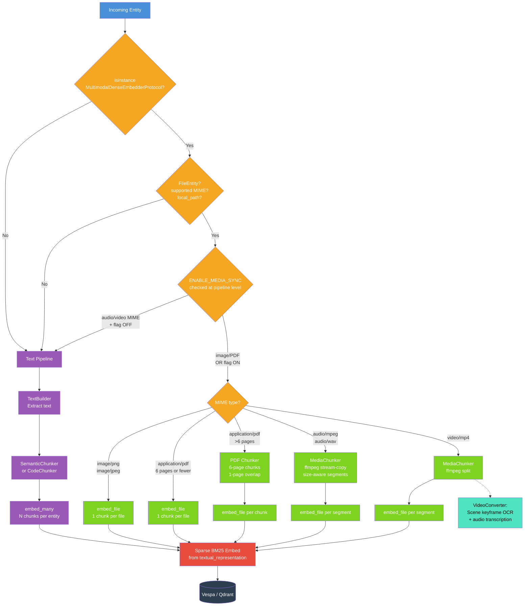
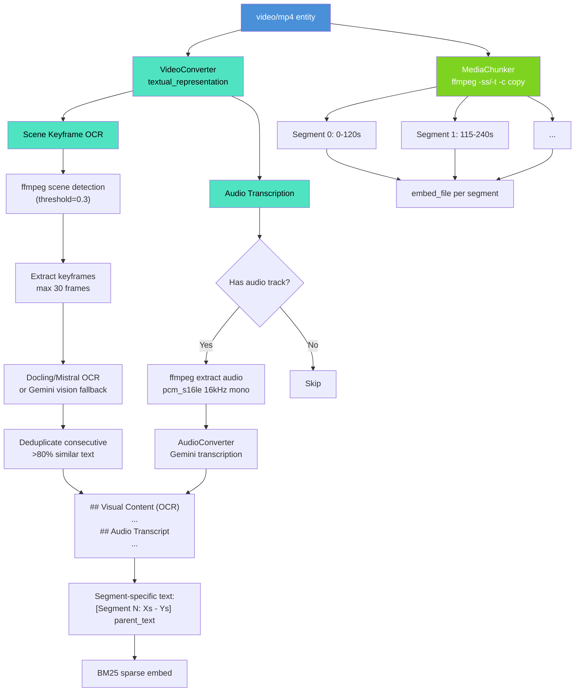
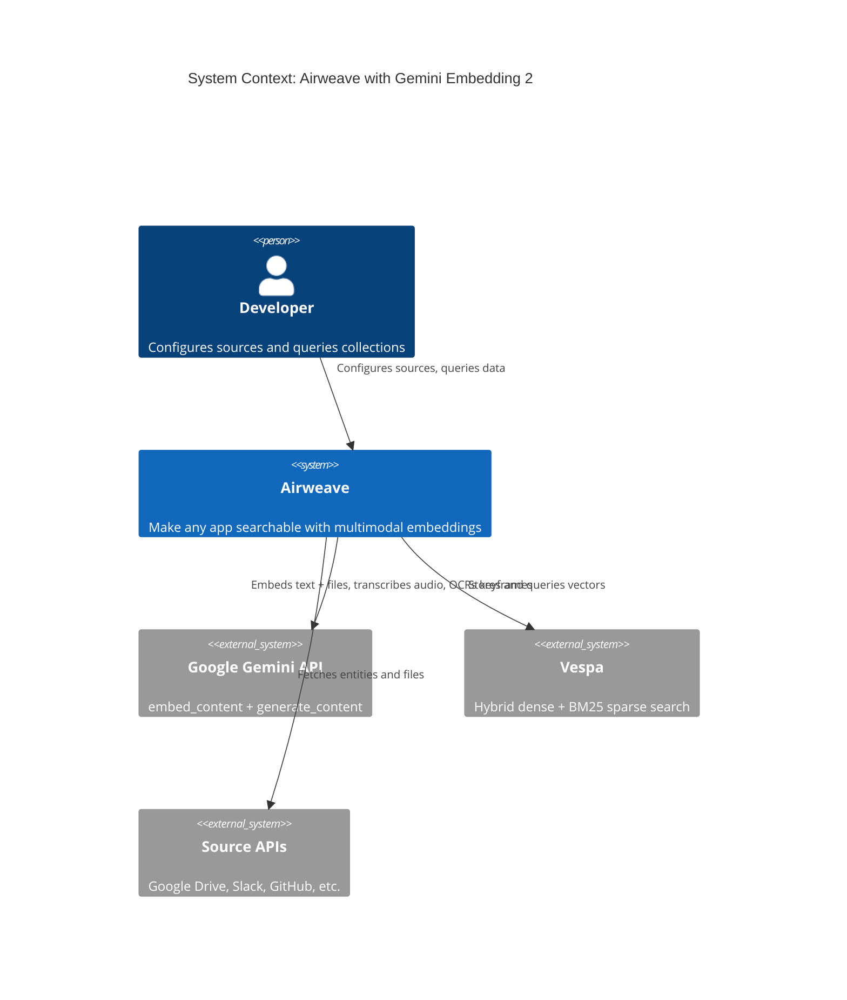
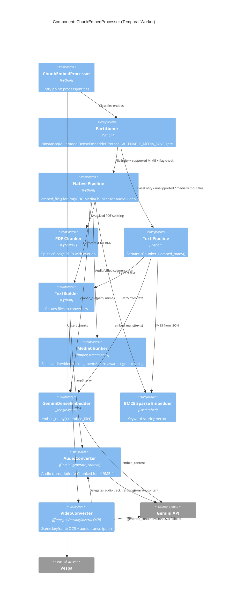
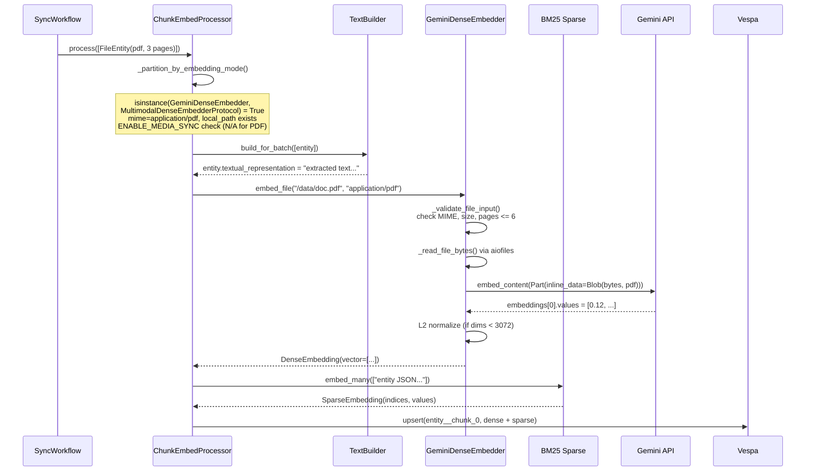
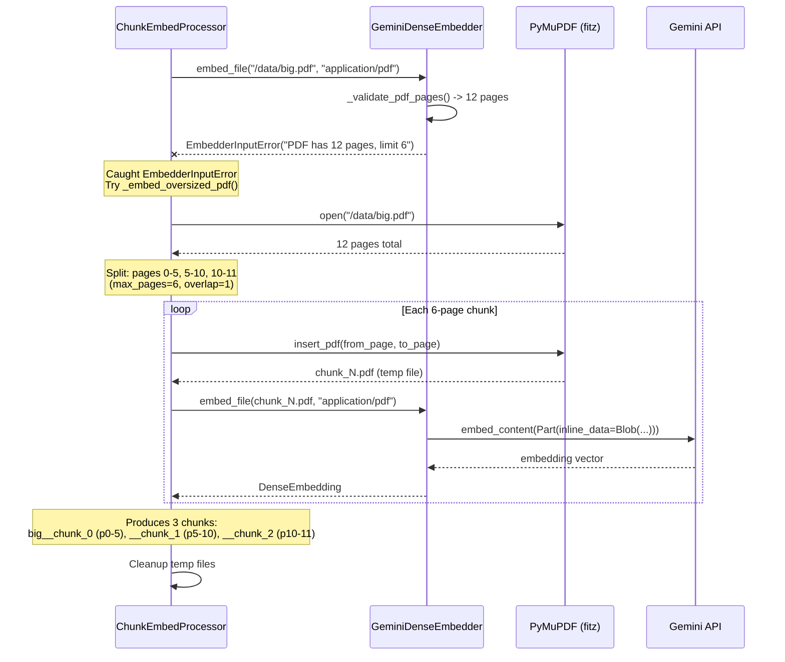
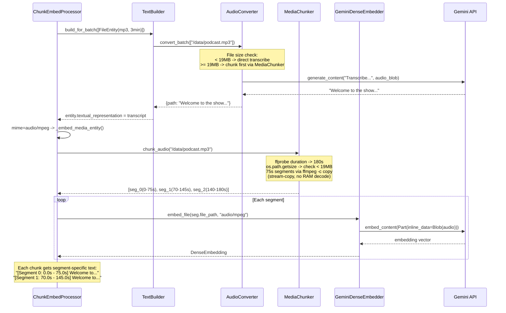
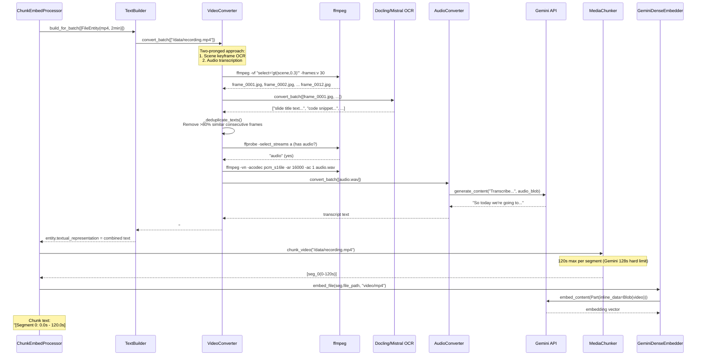
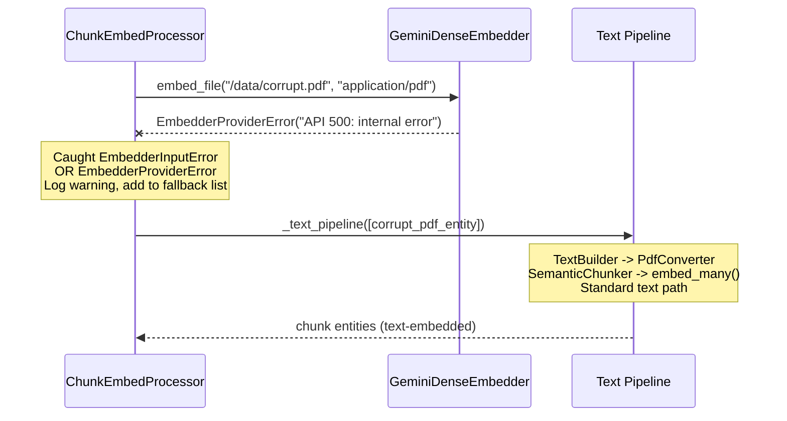
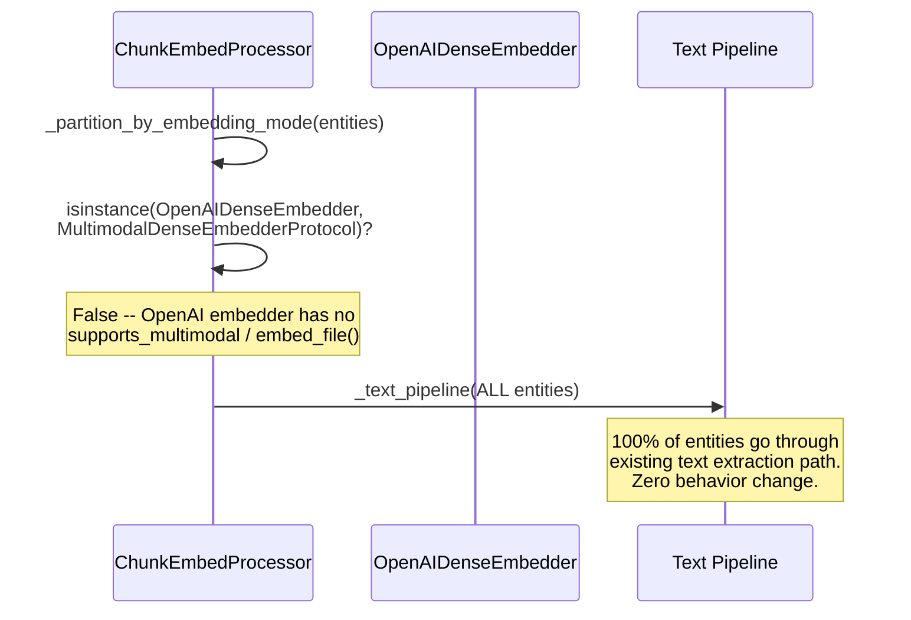

# Gemini Embedding 2: Full Multimodal Embedding Pipeline

> Native PDF, image, audio, and video embedding through Airweave's Vespa + Temporal pipeline, powered by Google's Gemini Embedding 2 model.

## What This Adds

Airweave's embedding pipeline previously extracted text from every file before computing vectors.
This feature extends that pipeline so the Gemini Embedding 2 provider can **embed raw files directly** -- PDFs, images, audio, and video -- through the native multimodal API, producing a single unified vector space where text queries retrieve documents, screenshots, recordings, and clips.

### Pipeline Decision Flow



### Video Pipeline Detail



### System Context



### Component Detail: Embedding Pipeline



## Interaction Diagrams

### Image/PDF Native Embedding (Happy Path)



### Oversized PDF Chunking



### Audio Chunking + Embedding



### Video: Scene Keyframe OCR + Audio Transcription



### Fallback: Embed Failure



### Protocol Detection (Non-Multimodal Embedder)



## Architecture at a Glance

| Layer | Component | What it does |
|-------|-----------|-------------|
| **Protocol** | `MultimodalDenseEmbedderProtocol` | Runtime-checkable interface for `embed_file()` |
| **Embedder** | `GeminiDenseEmbedder.embed_file()` | Validates, reads, sends `Part(inline_data=Blob(...))` to Gemini |
| **Pipeline** | `ChunkEmbedProcessor._partition_by_embedding_mode()` | Routes FileEntity to native or text path; enforces `ENABLE_MEDIA_SYNC` for audio/video MIMEs |
| **Pipeline** | `ChunkEmbedProcessor._native_multimodal_pipeline()` | 1-chunk-per-file for images, N-chunks for oversized PDFs and media |
| **Pipeline** | `ChunkEmbedProcessor._embed_oversized_pdf()` | Splits >6-page PDFs into chunks with configurable overlap via PyMuPDF |
| **Pipeline** | `ChunkEmbedProcessor._embed_media_entity()` | Chunks audio/video, embeds per segment, assigns segment-specific text |
| **Chunker** | `MediaChunker` | Splits audio (ffmpeg stream-copy) and video (ffmpeg) into embeddable segments; size-aware segment sizing for oversized files |
| **Converter** | `AudioConverter` | Gemini-based transcription; auto-chunks files >19MB via MediaChunker |
| **Converter** | `VideoConverter` | Scene-based keyframe OCR (ffmpeg scene detection + Docling/Mistral OCR + deduplication) + audio transcription |
| **Config** | `ENABLE_MEDIA_SYNC` | Feature flag gating audio/video at the **pipeline level** (not source-specific) |

## Key Design Decisions

1. **Protocol, not class hierarchy** -- `MultimodalDenseEmbedderProtocol` is `@runtime_checkable`. The pipeline detects capability via `isinstance()`, so OpenAI/Mistral/Local embedders are unaffected. ([ADR-001](./adr-001-protocol-over-inheritance.md))

2. **File path, not bytes** -- `embed_file()` takes a path string, reads from disk inside the embedder, and discards bytes after the API call. This prevents the `model_copy(deep=True)` memory amplification at chunk_embed.py:203. Audio chunking also uses ffmpeg stream-copy instead of pydub RAM decode to avoid OOM on large files. ([ADR-002](./adr-002-file-path-over-bytes.md))

3. **Text always extracted** -- Even for natively-embedded files, `textual_representation` is populated via existing converters. BM25 sparse scoring, answer generation, and reranking all depend on text.

4. **Graceful fallback** -- If `embed_file()` raises `EmbedderInputError` or `EmbedderProviderError`, the entity falls back to the text pipeline with a warning log. For oversized PDFs, the pipeline first attempts 6-page chunking before falling back to text.

5. **Audio/video behind feature flag** -- `ENABLE_MEDIA_SYNC=false` by default. The flag is enforced at the **pipeline level** in `_partition_by_embedding_mode()` -- any source emitting audio/video MIME types is gated, not just Google Drive. ([ADR-003](./adr-003-feature-flag-for-media.md))

6. **Scene-based keyframe OCR for video** -- VideoConverter uses ffmpeg scene detection to extract keyframes only when screen content changes, then OCRs each via Docling/Mistral (or Gemini vision fallback). Consecutive frames >80% similar are deduplicated. This captures slide text and UI content without fixed-interval waste. ([ADR-004](./adr-004-scene-keyframe-ocr.md))

7. **Segment-specific textual_representation** -- Media chunks get `[Segment N: Xs - Ys] parent_text` as their textual_representation, not the full parent transcript duplicated across all chunks. This gives each chunk its own sparse embedding and answer context.

8. **No mean-pooling or aggregation** -- Gemini limits document parts to 1 per `embed_content` call. Each chunk/segment is embedded independently, producing separate vectors in Vespa. This matches the existing text chunking model. The `MULTIMODAL_AGGREGATION` setting exists but only `"separate"` is the supported mode.

## File Inventory

### New Files (11)
| File | Lines | Purpose |
|------|-------|---------|
| `domains/embedders/dense/tests/test_gemini_multimodal.py` | ~356 | 24 tests: file validation, embed_file, API errors, protocol compliance |
| `platform/chunkers/media.py` | ~327 | MediaChunker + MediaSegment: ffmpeg stream-copy splitting with size-aware segment sizing |
| `platform/converters/audio_converter.py` | ~118 | Gemini-based audio transcription with auto-chunking for >19MB files |
| `platform/converters/video_converter.py` | ~341 | Scene-based keyframe OCR + audio transcription for video |
| `tests/unit/platform/chunkers/test_media.py` | ~216 | 9 tests for audio/video chunking including size-aware splitting |
| `tests/unit/platform/converters/test_audio_converter.py` | ~81 | 5 tests for audio transcription |
| `tests/unit/platform/converters/test_video_converter.py` | ~62 | 4 tests for video keyframe OCR + transcription |
| `tests/unit/platform/sync/processors/test_chunk_embed_multimodal.py` | ~321 | 12 tests for pipeline routing, fallback, and PDF chunking |
| `tests/unit/platform/sync/processors/test_multimodal_e2e.py` | ~416 | 10 E2E tests with synthetic media (PyMuPDF, wave, ffmpeg) |
| `tests/live_integration/test_gemini_multimodal_live.py` | ~327 | 9 live integration tests hitting real Gemini API |
| `tests/unit/search/operations/test_embed_query_purpose.py` | ~48 | 1 test for EmbeddingPurpose.QUERY in search |

### Modified Files (11)
| File | Change |
|------|--------|
| `domains/embedders/protocols.py` | +`MultimodalDenseEmbedderProtocol` |
| `domains/embedders/dense/gemini.py` | +`embed_file()`, multimodal validation, error refactor |
| `domains/embedders/fakes/embedder.py` | +`FakeMultimodalDenseEmbedder` |
| `platform/sync/processors/chunk_embed.py` | Refactored into text + native pipelines; catches both `EmbedderInputError` and `EmbedderProviderError` |
| `platform/converters/__init__.py` | Registered audio/video converters |
| `platform/sync/pipeline/text_builder.py` | Audio/video converter routing |
| `platform/sync/file_types.py` | +`.mp3`, `.wav`, `.mp4` |
| `platform/sources/google_drive.py` | Video skip gated behind `ENABLE_MEDIA_SYNC` |
| `core/config/settings.py` | +`ENABLE_MEDIA_SYNC` + all `MULTIMODAL_*` settings |
| `Dockerfile`, `Dockerfile.dev`, `temporal/Dockerfile` | +`ffmpeg` |
| `pyproject.toml` | +`pydub` (fallback only; primary path uses ffmpeg) |

## Test Results

```
113 tests total across 3 test tiers
```

### Unit Tests (79 tests)
- 25 Phase 1 tests (text-only Gemini embedder, pre-existing) -- all pass unchanged
- 24 Phase 2 tests (multimodal embedder + protocol)
- 12 Phase 2B tests (pipeline routing, fallback, and PDF chunking)
- 9 Phase 3 tests (media chunking with ffmpeg stream-copy)
- 5 Phase 3 tests (audio transcription)
- 4 Phase 3 tests (video keyframe OCR + transcription)

### E2E Tests (10 tests)
- Generate real media with PyMuPDF, `wave` stdlib, and ffmpeg
- No AI API cost -- all Gemini calls mocked
- Verify full pipeline routing, chunking, and fallback with real file I/O

### Live Integration Tests (9 tests)
- Hit the REAL Gemini API with real generated media
- Verify actual embedding dimensions, L2 normalization, and cross-modal similarity
- Require `GEMINI_API_KEY` env var and network access
- Run via: `pytest tests/live_integration/ -v -m live_integration`

### Pre-Existing Tests (14 + 1)
- 14 pre-existing chunk_embed tests -- all pass unchanged
- 1 query purpose test (EmbeddingPurpose.QUERY in search)

## Configuration Reference

All settings are via environment variables with sensible defaults. Only active when `DENSE_EMBEDDER=gemini-embedding-2-preview`.

| Variable | Default | Description |
|----------|---------|-------------|
| `ENABLE_MEDIA_SYNC` | `false` | Gate audio/video embedding. Enforced at pipeline level for ALL sources. |
| `MULTIMODAL_PDF_MAX_PAGES` | `6` | Max pages per native PDF embed call (Gemini limit = 6) |
| `MULTIMODAL_PDF_OVERLAP_PAGES` | `1` | Overlap pages when splitting oversized PDFs |
| `MULTIMODAL_MAX_FILE_SIZE_MB` | `20` | Max file size for any single native embed call |
| `MULTIMODAL_AUDIO_MAX_SECONDS` | `75` | Max seconds per audio segment (Gemini hard limit = 80s) |
| `MULTIMODAL_VIDEO_AUDIO_MAX_SECONDS` | `120` | Max seconds per video segment with audio (Gemini hard limit = 128s) |
| `MULTIMODAL_VIDEO_NOAUDIO_MAX_SECONDS` | `120` | Max seconds per video segment without audio (Gemini hard limit = 128s) |
| `MULTIMODAL_MEDIA_OVERLAP_SECONDS` | `5` | Overlap between consecutive audio/video segments |
| `MULTIMODAL_VIDEO_SCENE_THRESHOLD` | `0.3` | ffmpeg scene detection sensitivity (0.0-1.0). Lower = more frames. |
| `MULTIMODAL_VIDEO_MAX_KEYFRAMES` | `30` | Cap on keyframes extracted per video (limits OCR cost) |
| `MULTIMODAL_AGGREGATION` | `separate` | Aggregation mode. Only `"separate"` is supported (separate vectors in Vespa). Gemini limits PDFs to 1 per content entry. |

## Gemini Embedding 2 Limits

| Input Type | Gemini Hard Limit | Our Conservative Limit | Notes |
|-----------|-------------------|----------------------|-------|
| Text | 8,192 tokens | 40,000 chars (~10K tokens) | |
| PDF | 6 pages | 6 pages per chunk | >6 pages auto-split with overlap |
| Image | 6 per request | 1 per request (native embed) | |
| Audio | 80 seconds | 75 seconds per segment | With 5s overlap between segments |
| Video (with audio) | 128 seconds | 120 seconds per segment | With 5s overlap between segments |
| Video (no audio) | 128 seconds | 120 seconds per segment | With 5s overlap between segments |
| File size | 20 MB | 20 MB (19 MB internal threshold) | Size-aware segment sizing for oversized audio |
| Output dimensions | Up to 3,072 (Matryoshka) | Configurable via `EMBEDDING_DIMENSIONS` | |

## Cross-Validation History

Six rounds of cross-validation across Codex, Gemini, and Amp Oracle:

- **R1**: Identified 10 issues (audio OOM on large files, missing EmbedderProviderError catch, source-only media flag, TOCTOU in temp files, container overhead in size calculations, duplicated parent transcript in media chunks)
- **R2-R5**: Iterative fixes addressing each finding
- **R6**: Final signoff from all 3 models -- all issues resolved

## Quick Start

No configuration change needed for PDF/image multimodal -- it activates automatically when `DENSE_EMBEDDER=gemini-embedding-2-preview` is set.

For audio/video:
```env
ENABLE_MEDIA_SYNC=true
GEMINI_API_KEY=your-key
```

## Related

- [ADR-001: Protocol over inheritance](./adr-001-protocol-over-inheritance.md)
- [ADR-002: File path over bytes](./adr-002-file-path-over-bytes.md)
- [ADR-003: Feature flag for media](./adr-003-feature-flag-for-media.md)
- [ADR-004: Scene-based keyframe OCR for video](./adr-004-scene-keyframe-ocr.md)
- [C4 Structurizr DSL](./c4-architecture.dsl)
- [C4 PlantUML](./c4-component.puml)
